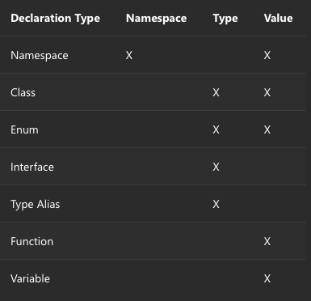

# TS Study(W4) - 선언 병합

## Declaration Merging / 선언병합?

> For the purposes of this article, “declaration merging” means that the compiler merges two separate declarations declared with the same name into a single definition.

컴파일러가 `같은 이름으로 선언된 두 개의 개별적인 선언을 하나의 정의로 병합`하는 것.

- 병합된 정의는 **기존에 선언된 기능**을 모두 갖게 됨.
- 병합할 선언의 개수는 상관없음.

⇒ 이 Technique은 Exisiting JS을 TS와 더 효율적으로 조합해서 사용하는 것에 목적을 둔다. 

## Basic Concepts

TS에서의 **선언**은 `Namespace, Type, Value` 중 한 종류 이상의 엔티티를 생성.

- Namespace-creating declarations
    - `.(Dot)` 으로 구분된 표기법을 이용하여 접근할 이름을 가진 Namespace를 생성.
- Type-creating declarations
    - 지정된 이름에 바인딩 된 Type을 생성.
- Value-creating declarations
    - Javascript에서 확인할 수 있는 값을 생성.



## Merging Interfaces

가장 일반적이며 간단한 `선언 병합` 유형.

### 기본

- Declaration의 모든 members들을 하나의 Interface로 병합.
- 인터페이스의 `비 함수 멤버가 고유`해야 한다.
- 고유하지 않은 경우, `모두 같은 타입`이어야 한다.

```tsx
interface Box {
	height: number;
	width: number;
}

interface Box {
	scale: number;
	// !! 비-함수 멤버가 고유하지 않고 타입이 다를 경우
	// Subsequent property declarations must have the same type.  
	// Property 'height' must be of type 'number', but here has type 'string'.(2717)	
	// height: string;
}

let box: Box = {height: 5, width: 6, scale: 10};
```

- **같은 이름의 함수 멤버**의 경우 `Overload` 처리한다.
    - 이때, 더 나중에 오는 Interface가 더 높은 우선순위를 갖는다.

```tsx
interface Cloner {
	clone(animal: Animal): Animal;
}

interface Cloner {
	clone(animal: Sheep): Sheep;
}

interface Cloner {
	clone(animal: Dog): Dog;
	clone(animal: Cat): Cat;
}

// 병합 결과
interface Cloner {
	clone(animal: Dog): Dog;
	clone(animal: Cat): Cat;
	clone(animal: Sheep): Sheep;
	clone(animal: Animal): Animal;
 }
```

- 특수 시그니처를 사용하는 경우, Overload를 예외 처리할 수 있다.
    - 특수 시그니처?
        - EX > 시그니처에 `단일 문자열 리터럴 타입`인 매개변수가 있는 경우
        - 단일 문자열 리터럴 타입: 문자열 리터럴의 유니언이 아닌 타입

```tsx
interface Document {
	createElement(tagName: any): Element;
}

interface Document {
	createElement(tagName: "div"): HTMLDivElement;
	createElement(tagName: "span"): HTMLSpanElement;
}
interface Document {
	createElement(tagName: string): HTMLElement;
	createElement(tagName: "canvas"): HTMLCanvasElement;
}

// 병합 결과
interface Document {
	// 특수 시그니쳐 (단일 문자열 리터럴 타입을 사용)
	createElement(tagName: "canvas"): HTMLCanvasElement;
	createElement(tagName: "div"): HTMLDivElement;
	createElement(tagName: "span"): HTMLSpanElement;
	// 일반
	createElement(tagName: string): HTMLElement;
	createElement(tagName: any): Element;
}
```

## Merging Namespaces

인터페이스와 마찬가지로 같은 이름을 가진 Namespace도 멤버를 병합.

- Namespace의 경우 Namespace와 Value entity를 모두 갖는다는 것을 잊지말자!

Namespace의 병합 과정은 다음과 같다.

- Namespace의 병합
    - 각 namespace에서 exported interface를 하나의 namespace에 merge한다.
    - 이때, 순서는 Interface와 같다. (후순위가 더 높음)
- Namespace value의 병합
    - 각 namespace에서 exported된 member를 하나의 namespace에 merge한다.

```tsx
namespace Animals {
	export class Zebra { }
} 
namespace Animals {
	export interface Legged { numberOfLegs: number }
	export class Dog { }
}

// 병합 결과
namespace Animals {
	// Exported inteface
	export interface Legged { ... }

	// Exported members
	export class Zebra {}
	export class Dog {}
}
```

- Non-exported members를 가진 namespace를 병합하는 경우
    - Non-exported members는 원본 namespace에서만 visible함.

    ```tsx
    namespace Animal {
      let haveMuscles = true;

      export function animalsHaveMuscles() {
        return haveMuscles;
      }
    }

    // 병합 결과
    namespace Animal {
      export function doAnimalsHaveMuscles() {
        return haveMuscles; // Error, because haveMuscles is not accessible here
      }
    }
    ```

## Merging Namespaces with Classes, Functions and Enums

Namespaces는 다른 선언(declarations)과 병합할 수 있음.

이를 위해서 Namespace의 선언은 병합할 대상의 선언을 따라야 한다.

⇒ 이 Technique을 통해 JS 및 다른 프로그래밍 언어의 패턴을 모델링한다.(??)

### Merging Namespaces with Classes

- Inner class pattern 샘플 코드

```tsx
class Outer {
	constructor(public inner: Outer.Inner) { }
}

namespace Outer {
	export class Inner {
		inInner: number
	};
}

let outer1 = new Outer({ inInner: 3 });

let outerInner = new Outer.Inner();
let outer2 = new Outer(outerInner);
```

- 함수를 확장하는 패턴

```tsx
function buildLabel(name: string): string {
	return buildLabel.prefix + name + buildLabel.suffix;
}

namespace buildLabel {
	export let suffix = "";
	export let prefix = "Hello, ";
}

console.log(buildLabel("Sam Smith")); // "Hello, Sam Smith"
```

- enum을 확장하는 패턴

```tsx
enum Color {
	red = 1,
	green = 2,
	blue = 4
}

namespace Color {
	export function mixColor(colorName: string) {
		if (colorName == "yellow") {
	    return Color.red + Color.green;
		}
		else if (colorName == "white") {
	    return Color.red + Color.green + Color.blue;
		}
		else if (colorName == "magenta") {
	    return Color.red + Color.blue;
		}
		else if (colorName == "cyan") {
	    return Color.green + Color.blue;
		}
		
		return 
	}
}

console.log(Color.mixColor("yellow")) // 3
```

## Disallowed Merges / 허용되지 않는 병합

`Class와 다른 Class` 혹은 `Class 와 변수`는 병합할 수 없음.

→ Class의 병합은 TS의 Mixin pattern을 사용

## Module Augmentation / 모듈 보강

Javascript는 모듈 병합을 지원하지 않지만 기존 객체를 가져와 업데이트하는 방법으로 가능하다.

```tsx
// observable.ts
export class Observable<T> {
	...
}
```

```tsx
// map.ts
import { Observable } from "./observable";

// Typescript에서 잘 동작하지만 Compiler가 Observable.prototype.map에 대해서 알 수 없음.
Observable.prototype.map = function (f) {
	...
}
```

```tsx
import { Observable } from "./observable";

// 모듈 보강
declare module "./observable" {
	interface Observable<T> {
		map<U>(f: (x: T) => U): Observable<T>
	}
}

// Compiler가 Observable.prototype.map에 대한 정보를 얻음.
Observable.prototype.map = function (f) {
	...
}
```

모듈 보강에서 주의할 점은

- 기존 선언에 대한 패치만 가능 (새로운 최상위 선언을 할 수 없음.)
- `default export` 는 보강할 수 없음. (이름을 갖는 export만 가능 / 해당 이름으로 확장)
- Ref

    [Unable to do module augmentation (1.8 beta) · Issue #6722 · microsoft/TypeScript](https://github.com/microsoft/TypeScript/issues/6722)

    [Module augmentation difficulties with AMD/CommonJS/globals · Issue #7015 · microsoft/TypeScript](https://github.com/microsoft/TypeScript/issues/7015)

## Global Augmentation / 전역 보강

모듈 내부에서 전역 범위에 선언을 추가할 수도 있다.

```tsx
// observable.ts
export class Observable<T> {
	...
}

// 전역 보강
declare global {
  interface Array<T> {
    toObservable(): Observable<T>;
  }
}

Array.prototype.toObservable = function () {
  // ...
};
```

## References

[TypeScript 한글 문서](https://typescript-kr.github.io/pages/declaration-merging.html)