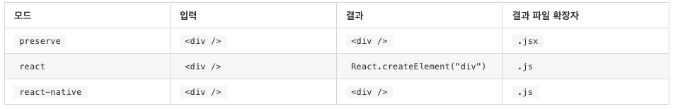
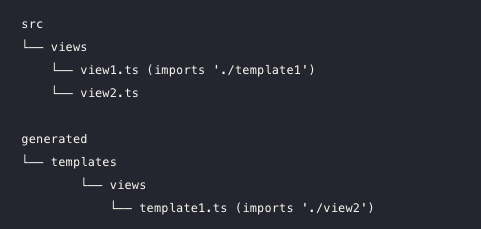

# TS Study(W6) - 이터레이터, 제네레이터 / JSX / 믹스인 / 모듈

## Iterator & Generator

- ES5 / ES3 를 대상으로 하는 경우 Array 유형의 값만 Iterator 로서 취급함.
- 즉, `Symbol.iterator`를 구현하더라도 `for...of` 루프를 사용할 수 없음.
- 추가로 컴파일러가  `for...of` 루프에 대해서 `for` 루프를 생성하게 됨.

```tsx
let numbers = [1, 2, 3];
for (let num of numbers){
 console.log(num);
}
```

```jsx
// target: es5 / es3
"use strict";
var numbers = [1, 2, 3];
for (var _i = 0, numbers_1 = numbers; _i < numbers_1.length; _i++) {
    var num = numbers_1[_i];
    console.log(num);
}
```

## JSX

- TS는 다음과 같은 3가지 JSX 모드를 제공함.



- 이 모드들은 타입 검사 시에는 아무 영향을 받지 않으며 방출 단계에서 영향을 미침.
    - preserve: Babel같은 다른 변환 단계에서 사용하도록 결과물의 일부를 유지함.
    - react: React.createElement를 생성하여 JSX → JS로 변경.
    - react-native: JSX를 유지하지만 결과로는 JS가 됨.

### JSX - 타입 검사

- JSX의 타입검사는 2가지로 나뉜다.
- 내장 요소 (Intrinsic elements)
    - 환경에 내장된 요소 (EX > div, span...) + 항상 소문자로 시작.
    - 특수한 인터페이스에서 조회해서 타입 검사를 진행함.

    ```tsx
    declare namespace JSX {
        interface IntrinsicElements {
            foo: any
        }
    }

    <foo />; // 성공
    <bar />; // 오류
    ```

- 값-기반 요소 (Value-based elements)
    - 사용자가 직접 정의한 컴포넌트 + 항상 대문자로 시작.
    - 해당 스코프에 있는 식별자로 간단하게 조회해서 타입 검사를 진행함.

    ```tsx
    import MyComponent from "./myComponent";

    <MyComponent />; // 성공
    <SomeOtherComponent />; // 오류
    ```

    ## 모듈 해석

    - 컴파일러가 import가 무엇을 참조하는지 알아내기 위해 사용하는 프로세스.
    - 모듈 해석 전략은 노드와 클래식 두가지가 있음.
        - 클래식: Default

            ```tsx
            // 소스파일 위치: /root/src/folder/A.ts

            import Test from './moduleB'
            // 상대적 import 조회 순서
            // /root/src/folder/moduleB.ts
            // /root/src/folder/moduleB.d.ts

            import Test from 'moduleB'
            // 비상대적 import 조회 순서
            // /root/src/folder/moduleB.ts
            // /root/src/folder/moduleB.d.ts
            // /root/src/moduleB.ts
            // /root/src/moduleB.d.ts
            // /root/moduleB.ts
            // /root/moduleB.d.ts
            // /moduleB.ts
            // /moduleB.d.ts
            ```

        - 노드: Node.js의 모듈 해석 메커니즘을 모방.

            [Node.js v15.2.0 Documentation](https://nodejs.org/api/modules.html#modules_all_together)

            - 비상대적 모듈 해석에서 `node_modules` 를 조회한다는 차이가 있음.

    ### 상대적 모듈

    ```tsx
    // 모듈에 대해서 런타임에 상대적 위치를 유지하는 것을 보장함.
    import TestModule from '../test'
    ```

    ### 비 상대적 모듈

    ```tsx
    // 외부 의존성 or baseURL로 해석 or 경로 매핑으로 해석.
    import TestModule from 'test'
    ```

    ### 기본 URL (Base URL)

    - `baseUrl` 은 컴파일러에게 어디서 모듈을 찾을지 알려주는 역할.
    - 모든 비 상대적 이름의 모듈의 import는 baseURL이 상대적으로 가정함.
    - paths 역시 baseURL에 매핑된다.

    ### rootDirs 를 이용한 가상 디렉토리

    

    다음과 같은 프로젝트 구조에서 소스가 모두 결합되어 단일 출력 디렉터리를 생성하는 경우에 rootDirs를 이용하여 런타임에 병합할 것이라고 예상되는 roots의 목록을 지정할 수 있음.

    ```json
    {
      "compilerOptions": {
        "rootDirs": [
          "src/views",
          "generated/templates/views"
        ]
      }
    }
    ```

    ### 모듈 해석 추적 / Tracing module resolution

    ```bash
    $ tsc --traceResolution
    ```

    ### —noResolve 사용

    - 일반적으로 컴파일 시작전에 모든 모듈 import를 해석하려고 함.
    - —noResolve 옵션은 명령 줄에 전달하지 않은 파일은 컴파일에 "추가" 하지 않도록 지시.

    ```bash
    $ tsc app.ts moduleA.ts --noResolve
    ```